# MODUL 15: STRUKTUR DATA DALAM BIG DATA DAN AI

---

**Mata Kuliah:** Struktur Data  
**Program Studi:** Sistem Informasi - Institut Teknologi Kalimantan  
**SKS:** 3 (2 Teori + 1 Praktikum)  
**Pertemuan:** 15 dari 16

---

## Estimasi Waktu Pembelajaran

Berdasarkan **Permendikbud No. 3 Tahun 2020** tentang SN-Dikti:

| Komponen | Kegiatan | Durasi |
|----------|----------|--------|
| **TEORI (2 SKS)** | | |
| Tatap Muka | Kuliah di kelas | 100 menit |
| Tugas Terstruktur | Pengembangan dari presentasi (dikumpulkan) | 120 menit |
| Belajar Mandiri | Belajar sendiri | 120 menit |
| **PRAKTIKUM (1 SKS)** | | |
| Kegiatan Lab | Presentasi Proyek Kelompok | 100 menit |
| Belajar Mandiri | Belajar sendiri | 70 menit |
| **TOTAL** | | **510 menit (~8.5 jam)** |

---

## Capaian Pembelajaran

### Sub-CPMK
Setelah menyelesaikan pertemuan ini, mahasiswa mampu:
1. Menjelaskan bagaimana struktur data digunakan dalam konteks Big Data dan Artificial Intelligence
2. Memahami konsep dan mengimplementasikan Trie (Prefix Tree) sederhana
3. Memahami konsep Tensor sebagai struktur data utama dalam Machine Learning
4. Mengidentifikasi struktur data yang tepat untuk berbagai skenario Big Data dan AI

### Indikator Pencapaian
- Mahasiswa dapat menjelaskan hubungan antara struktur data dengan Big Data dan AI
- Mahasiswa dapat mengimplementasikan Trie sederhana dalam Python
- Mahasiswa dapat menjelaskan perbedaan Scalar, Vector, Matrix, dan Tensor
- Mahasiswa dapat mempresentasikan proyek kelompok implementasi struktur data

---

# BAGIAN A: TATAP MUKA (100 Menit)

## 1. Pendahuluan: Struktur Data dalam Era Big Data & AI (10 menit)

### 1.1 Mengapa Topik Ini Penting?

Selama 14 pertemuan sebelumnya, kita telah mempelajari berbagai struktur data fundamental. Sekarang kita akan melihat **bagaimana struktur data tersebut diterapkan** dalam dua bidang paling relevan saat ini: **Big Data** dan **Artificial Intelligence**.

> 💡 **Pesan Utama:**
> Struktur data bukan hanya teori — ia adalah **fondasi** yang menentukan apakah sistem Big Data dan AI bisa bekerja secara efisien atau tidak.

### 1.2 Peta Hubungan

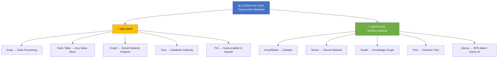

### 1.3 Struktur Data yang Sudah Dipelajari vs Penerapannya

| Struktur Data | Penerapan Big Data | Penerapan AI |
|---------------|--------------------|--------------|
| **Array** | Batch data processing | Dataset, feature vector |
| **Linked List** | Stream processing | Sequence model |
| **Stack** | Undo/redo pada data pipeline | Backtracking search |
| **Queue** | Message queue (Kafka) | BFS, task scheduling |
| **Tree/BST** | Database index (B-Tree) | Decision tree, parse tree |
| **Graph** | Social network, web crawl | Knowledge graph, GNN |
| **Hash Table** | Key-value store (Redis) | Feature hashing |
| **Sorting** | Data preprocessing | Ranking algorithm |
| **Searching** | Information retrieval | Nearest neighbor search |

---

## 2. Trie — Prefix Tree (30 menit)

### 2.1 Apa itu Trie?

**Trie** (dibaca "try") adalah struktur data tree khusus yang digunakan untuk **menyimpan dan mencari string secara efisien**. Setiap node mewakili satu karakter, dan path dari root ke node tertentu membentuk sebuah prefix (awalan).

> 💡 **Nama "Trie"** berasal dari kata re**TRIE**val — karena sangat efisien untuk operasi pencarian string.

### 2.2 Kenapa Tidak Pakai Hash Table Saja?

| Aspek | Hash Table | Trie |
|-------|-----------|------|
| Cari kata exact | O(L) — L = panjang kata | O(L) |
| Cari semua kata berawalan "pre" | O(n) — harus cek semua | O(L + k) — L = prefix, k = hasil |
| Autocomplete | Tidak efisien | Sangat efisien |
| Penggunaan memori | Lebih hemat per kata | Lebih boros (banyak pointer) |
| Urutan leksikografis | Tidak terurut | Otomatis terurut |

> 📝 **Kesimpulan:** Trie unggul untuk operasi berbasis **prefix** seperti autocomplete, spell checker, dan IP routing.

### 2.3 Visualisasi Trie

**Contoh:** Menyimpan kata "cat", "car", "card", "care", "dog", "do"

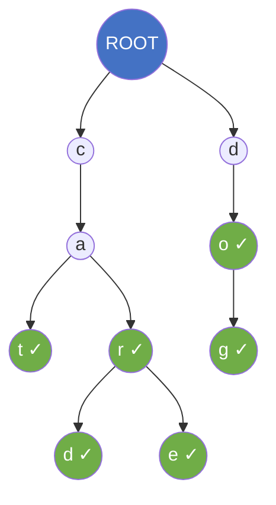

> ✓ menandakan **end of word** — node tersebut merupakan akhir dari sebuah kata valid.

### 2.4 Struktur Node Trie

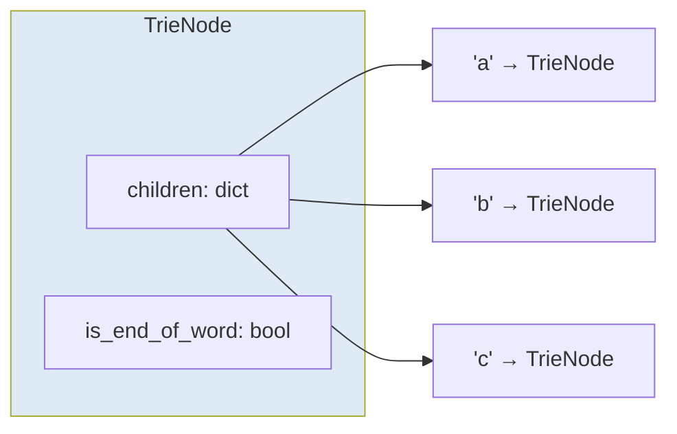

Setiap node memiliki:
1. **children** — dictionary yang menyimpan referensi ke node anak (key = karakter)
2. **is_end_of_word** — penanda apakah node ini akhir dari kata yang valid

### 2.5 Operasi pada Trie

#### A. INSERT — Menambahkan Kata

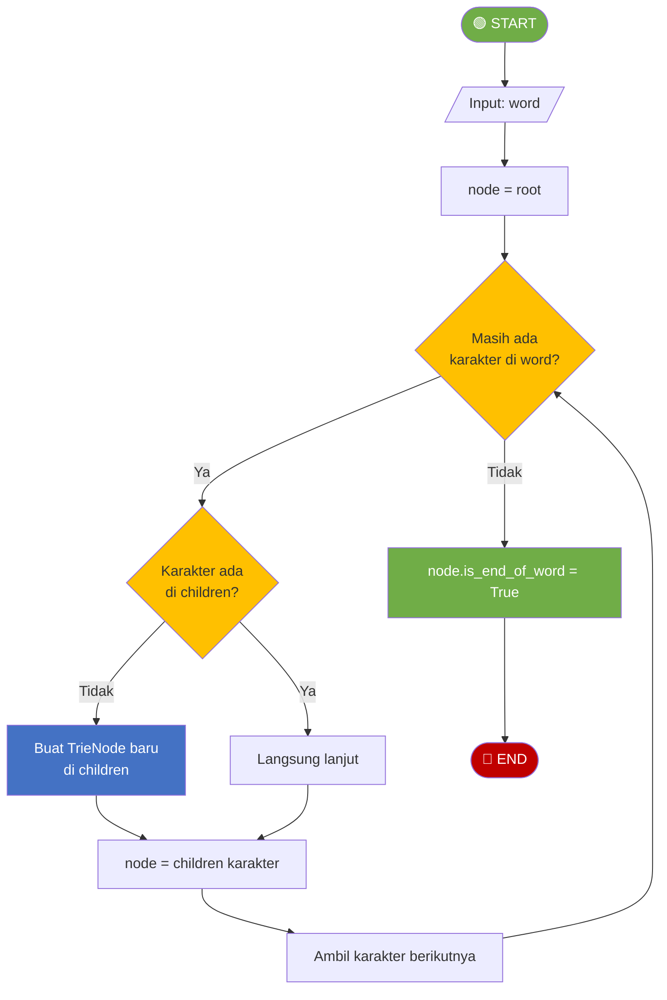

#### B. SEARCH — Mencari Kata

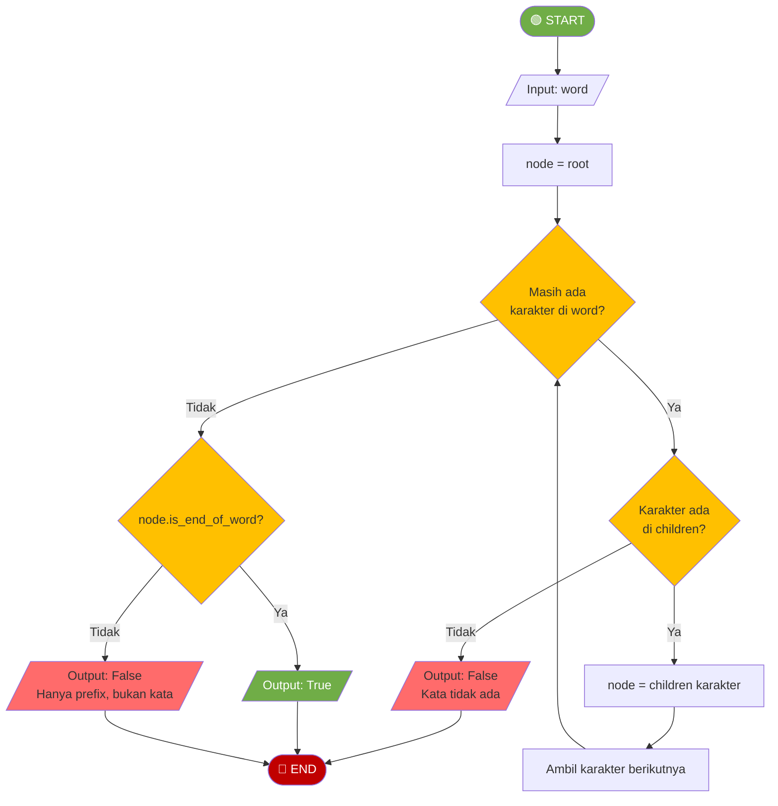

#### C. STARTS_WITH — Mencari Kata dengan Prefix Tertentu

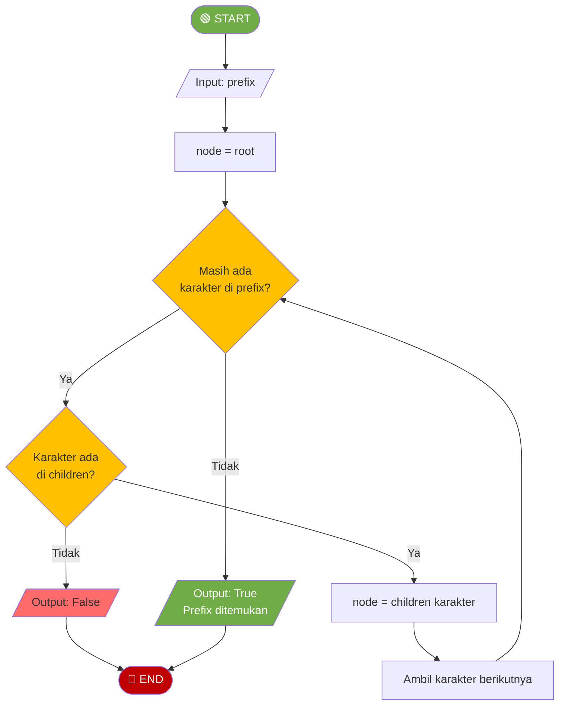

### 2.6 Kode Python

```python
class TrieNode:
    def __init__(self):
        self.children = {}           # dict: karakter → TrieNode
        self.is_end_of_word = False  # penanda akhir kata


class Trie:
    def __init__(self):
        self.root = TrieNode()
    
    def insert(self, word):
        """Menambahkan kata ke Trie — O(L), L = panjang kata"""
        node = self.root
        for char in word:
            if char not in node.children:
                node.children[char] = TrieNode()
            node = node.children[char]
        node.is_end_of_word = True
    
    def search(self, word):
        """Mencari kata exact di Trie — O(L)"""
        node = self.root
        for char in word:
            if char not in node.children:
                return False
            node = node.children[char]
        return node.is_end_of_word
    
    def starts_with(self, prefix):
        """Mengecek apakah ada kata dengan prefix tertentu — O(L)"""
        node = self.root
        for char in prefix:
            if char not in node.children:
                return False
            node = node.children[char]
        return True
    
    def get_all_words_with_prefix(self, prefix):
        """Mengambil semua kata yang dimulai dengan prefix — O(L + k)"""
        node = self.root
        for char in prefix:
            if char not in node.children:
                return []
            node = node.children[char]
        
        # DFS untuk mengumpulkan semua kata dari node ini
        results = []
        self._dfs_collect(node, prefix, results)
        return results
    
    def _dfs_collect(self, node, current_word, results):
        """Helper: DFS untuk mengumpulkan kata"""
        if node.is_end_of_word:
            results.append(current_word)
        for char, child_node in sorted(node.children.items()):
            self._dfs_collect(child_node, current_word + char, results)


# === CONTOH PENGGUNAAN ===
trie = Trie()
words = ["cat", "car", "card", "care", "dog", "do"]
for w in words:
    trie.insert(w)

print(trie.search("car"))       # True
print(trie.search("ca"))        # False (hanya prefix, bukan kata)
print(trie.starts_with("ca"))   # True
print(trie.get_all_words_with_prefix("car"))  # ['car', 'card', 'care']
```

### 2.7 Kompleksitas Trie

| Operasi | Kompleksitas | Keterangan |
|---------|-------------|------------|
| Insert | O(L) | L = panjang kata |
| Search | O(L) | L = panjang kata |
| Starts With | O(L) | L = panjang prefix |
| Get All with Prefix | O(L + k) | k = jumlah kata hasil |
| Space | O(N × L × A) | N = jumlah kata, L = rata-rata panjang, A = ukuran alfabet |

### 2.8 Penerapan Trie di Dunia Nyata

| Penerapan | Contoh |
|-----------|--------|
| **Autocomplete** | Google Search, IDE code completion |
| **Spell Checker** | Microsoft Word, Grammarly |
| **IP Routing** | Longest prefix match pada router |
| **T9 Predictive Text** | Keyboard HP jadul |
| **DNA Sequence** | Pencarian pola pada sequence genomik |

---

## 3. Tensor — Struktur Data untuk AI/ML (30 menit)

### 3.1 Dari Scalar ke Tensor

Dalam konteks AI dan Machine Learning, **Tensor** adalah generalisasi dari array multidimensi. Tensor adalah struktur data utama yang digunakan dalam framework ML seperti TensorFlow dan PyTorch.

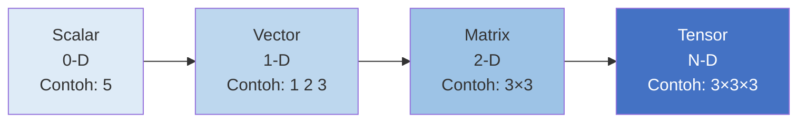

### 3.2 Hierarki Tensor

| Dimensi | Nama | Contoh di Python | Contoh di Dunia Nyata |
|---------|------|-----------------|----------------------|
| 0-D | **Scalar** | `x = 5` | Suhu: 36.5°C |
| 1-D | **Vector** | `v = [1, 2, 3]` | Harga saham 3 hari |
| 2-D | **Matrix** | `m = [[1,2],[3,4]]` | Gambar grayscale (baris × kolom) |
| 3-D | **Tensor 3D** | `t = [[[1,2],[3,4]],[[5,6],[7,8]]]` | Gambar RGB (tinggi × lebar × channel) |
| 4-D | **Tensor 4D** | `batch = [t1, t2, t3, ...]` | Batch gambar untuk training (batch × H × W × C) |

### 3.3 Visualisasi Dimensi Tensor

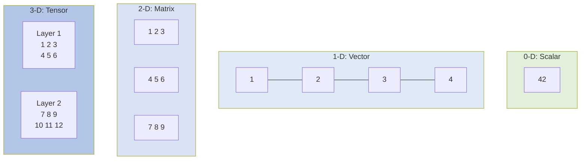

### 3.4 Tensor dengan NumPy

```python
import numpy as np

# === Scalar (0-D) ===
scalar = np.array(42)
print(f"Scalar: {scalar}, shape: {scalar.shape}, ndim: {scalar.ndim}")
# Scalar: 42, shape: (), ndim: 0

# === Vector (1-D) ===
vector = np.array([1, 2, 3, 4])
print(f"Vector: {vector}, shape: {vector.shape}, ndim: {vector.ndim}")
# Vector: [1 2 3 4], shape: (4,), ndim: 1

# === Matrix (2-D) ===
matrix = np.array([[1, 2, 3],
                   [4, 5, 6]])
print(f"Matrix shape: {matrix.shape}, ndim: {matrix.ndim}")
# Matrix shape: (2, 3), ndim: 2

# === Tensor 3D ===
tensor_3d = np.array([[[1, 2], [3, 4]],
                      [[5, 6], [7, 8]],
                      [[9, 10], [11, 12]]])
print(f"Tensor 3D shape: {tensor_3d.shape}, ndim: {tensor_3d.ndim}")
# Tensor 3D shape: (3, 2, 2), ndim: 3
```

### 3.5 Mengapa Tensor Penting untuk AI?

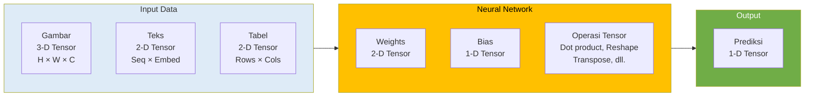

Alasan tensor adalah inti dari AI/ML:

1. **Representasi Data** — Semua data (gambar, teks, audio) dikonversi ke tensor sebelum diproses
2. **Operasi Paralel** — GPU sangat efisien memproses operasi tensor secara paralel
3. **Gradient Computation** — Backpropagation pada neural network adalah operasi pada tensor
4. **Batch Processing** — Tensor memungkinkan pemrosesan banyak data sekaligus

### 3.6 Contoh: Gambar sebagai Tensor

```python
import numpy as np

# Simulasi gambar RGB 4x4 piksel
# Shape: (tinggi, lebar, channel) = (4, 4, 3)
image = np.array([
    [[255, 0, 0],   [255, 0, 0],   [0, 0, 255],   [0, 0, 255]],    # Baris 0
    [[255, 0, 0],   [255, 0, 0],   [0, 0, 255],   [0, 0, 255]],    # Baris 1
    [[0, 255, 0],   [0, 255, 0],   [255, 255, 0], [255, 255, 0]],   # Baris 2
    [[0, 255, 0],   [0, 255, 0],   [255, 255, 0], [255, 255, 0]],   # Baris 3
])

print(f"Shape gambar: {image.shape}")       # (4, 4, 3)
print(f"Dimensi: {image.ndim}")             # 3
print(f"Total piksel: {image.shape[0] * image.shape[1]}")  # 16
print(f"Piksel [0][0] (RGB): {image[0][0]}")  # [255, 0, 0] → Merah

# Akses channel tertentu
red_channel = image[:, :, 0]    # Semua piksel, channel merah
print(f"Red channel shape: {red_channel.shape}")  # (4, 4)

# Batch gambar untuk training: 32 gambar sekaligus
batch_size = 32
batch = np.random.randint(0, 256, size=(batch_size, 4, 4, 3))
print(f"Batch shape: {batch.shape}")  # (32, 4, 4, 3)
```

### 3.7 Operasi Tensor Dasar

| Operasi | Deskripsi | Contoh di NumPy |
|---------|-----------|----------------|
| **Reshape** | Mengubah bentuk tanpa ubah data | `arr.reshape(2, 3)` |
| **Transpose** | Menukar sumbu | `arr.T` |
| **Dot Product** | Perkalian matrix/vektor | `np.dot(a, b)` |
| **Element-wise** | Operasi per elemen | `a + b`, `a * b` |
| **Broadcasting** | Operasi antar tensor beda shape | `matrix + vector` |
| **Slicing** | Mengambil subset | `tensor[0, :, 1:3]` |

```python
import numpy as np

# Reshape: ubah vektor 6 elemen jadi matrix 2×3
v = np.array([1, 2, 3, 4, 5, 6])
m = v.reshape(2, 3)
print(m)
# [[1 2 3]
#  [4 5 6]]

# Dot product: inti operasi neural network
weights = np.array([[0.1, 0.2],
                    [0.3, 0.4],
                    [0.5, 0.6]])
inputs = np.array([1.0, 2.0, 3.0])
output = np.dot(inputs, weights)   # (3,) dot (3,2) → (2,)
print(f"Output: {output}")         # [2.2 2.8]
```

---

## 4. Struktur Data untuk Big Data (20 menit)

### 4.1 Tantangan Big Data

Big Data memiliki karakteristik **5V**:

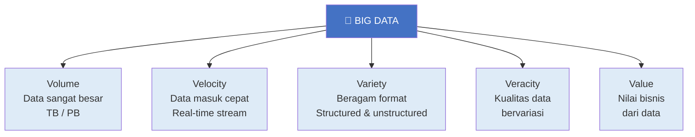

### 4.2 Struktur Data yang Relevan

#### A. Hash Map / Key-Value Store

Digunakan oleh sistem seperti **Redis**, **DynamoDB**, dan **Cassandra** untuk menyimpan data dalam format key-value.

```python
# Simulasi sederhana key-value store
class SimpleKeyValueStore:
    def __init__(self):
        self.store = {}          # Hash map internal
    
    def put(self, key, value):
        """Menyimpan data — O(1)"""
        self.store[key] = value
    
    def get(self, key):
        """Mengambil data — O(1)"""
        return self.store.get(key, None)
    
    def delete(self, key):
        """Menghapus data — O(1)"""
        if key in self.store:
            del self.store[key]

# Contoh: cache data user
cache = SimpleKeyValueStore()
cache.put("user:1001", {"name": "Andi", "email": "andi@email.com"})
cache.put("user:1002", {"name": "Budi", "email": "budi@email.com"})
print(cache.get("user:1001"))  # {'name': 'Andi', 'email': 'andi@email.com'}
```

> 📝 Hash Map memberikan akses **O(1)** — sangat penting untuk Big Data yang membutuhkan response time rendah.

#### B. B-Tree — Database Indexing

**B-Tree** adalah tree yang digunakan oleh hampir semua database relasional (MySQL, PostgreSQL) untuk **indexing**.

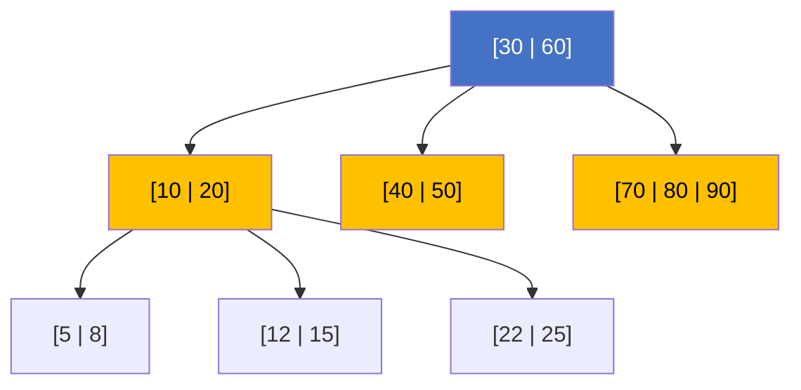

Keunggulan B-Tree untuk Big Data:

| Aspek | BST | B-Tree |
|-------|-----|--------|
| Tinggi untuk 1 juta data | ~20 level | ~3-4 level |
| Disk access per search | ~20 | ~3-4 |
| Cocok untuk disk storage | Tidak | Ya |
| Digunakan di database | Jarang | Hampir semua |

> 📝 B-Tree sangat efisien untuk data yang disimpan di **disk** (bukan RAM), karena setiap node menyimpan banyak key sekaligus, sehingga **mengurangi jumlah disk access**.

#### C. Graph — Network Analysis

Graph digunakan untuk menganalisis hubungan dalam Big Data:

| Penerapan | Node | Edge | Contoh Tools |
|-----------|------|------|-------------|
| Social Network | User | Pertemanan | Neo4j, Facebook TAO |
| Knowledge Graph | Entitas | Relasi | Google Knowledge Graph |
| Web Graph | Halaman | Hyperlink | PageRank Google |
| Fraud Detection | Transaksi | Aliran uang | TigerGraph |

#### D. Queue — Stream Processing

**Message Queue** digunakan untuk memproses data stream secara real-time:

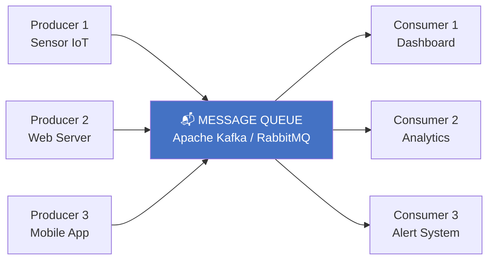

> 📝 Ini adalah penerapan langsung dari konsep **Queue (FIFO)** yang sudah kita pelajari di Pertemuan 6!

### 4.3 Bloom Filter — Struktur Data Probabilistik

**Bloom Filter** adalah struktur data berbasis hash yang menjawab pertanyaan: "Apakah elemen ini **mungkin** ada di set?" dengan sangat efisien.

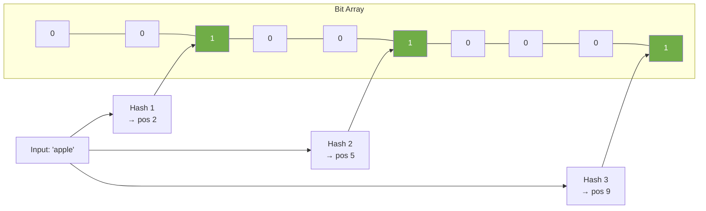

Karakteristik Bloom Filter:

| Aspek | Keterangan |
|-------|-----------|
| False Positive | Mungkin terjadi ("mungkin ada" padahal tidak) |
| False Negative | **Tidak pernah terjadi** ("tidak ada" pasti tidak ada) |
| Space | Sangat hemat (bit array) |
| Digunakan di | Google Chrome (cek malicious URL), Database (cek key sebelum disk access) |

---

## 5. Rangkuman dan Persiapan Review UAS (10 menit)

### 5.1 Peta Seluruh Materi Kuliah

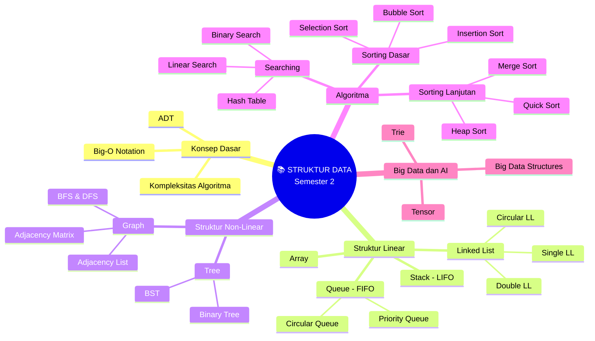

### 5.2 Rangkuman Kompleksitas Seluruh Materi

| Struktur Data / Algoritma | Access | Search | Insert | Delete |
|---------------------------|--------|--------|--------|--------|
| **Array** | O(1) | O(n) | O(n) | O(n) |
| **Linked List** | O(n) | O(n) | O(1)* | O(1)* |
| **Stack** | O(n) | O(n) | O(1) | O(1) |
| **Queue** | O(n) | O(n) | O(1) | O(1) |
| **BST** (avg) | O(log n) | O(log n) | O(log n) | O(log n) |
| **Hash Table** (avg) | — | O(1) | O(1) | O(1) |
| **Trie** | — | O(L) | O(L) | O(L) |

> *Jika sudah di posisi yang tepat

| Algoritma Sorting | Best | Average | Worst | Stable? |
|-------------------|------|---------|-------|---------|
| **Bubble Sort** | O(n) | O(n²) | O(n²) | Ya |
| **Selection Sort** | O(n²) | O(n²) | O(n²) | Tidak |
| **Insertion Sort** | O(n) | O(n²) | O(n²) | Ya |
| **Merge Sort** | O(n log n) | O(n log n) | O(n log n) | Ya |
| **Quick Sort** | O(n log n) | O(n log n) | O(n²) | Tidak |
| **Heap Sort** | O(n log n) | O(n log n) | O(n log n) | Tidak |

---

# BAGIAN B: PRESENTASI PROYEK KELOMPOK (100 Menit)

## Tujuan Sesi Presentasi
Mahasiswa mempresentasikan proyek kelompok yang mengimplementasikan struktur data untuk menyelesaikan permasalahan nyata.

> ⚠️ **Catatan:** Sesi ini menggantikan sesi praktikum reguler. Setiap kelompok (3-4 mahasiswa) mempresentasikan proyek yang telah dikerjakan selama semester.

---

## Format Presentasi

| Item | Keterangan |
|------|------------|
| **Jumlah Kelompok** | Disesuaikan dengan jumlah mahasiswa (3-4 per kelompok) |
| **Durasi per Kelompok** | 10 menit presentasi + 5 menit tanya jawab |
| **Total Waktu** | ~100 menit (6-7 kelompok) |
| **Format** | Slide presentasi + Demo program |

---

## Komponen Presentasi

Setiap kelompok wajib menyampaikan:

### 1. Latar Belakang Masalah (2 menit)
- Permasalahan apa yang dipecahkan?
- Mengapa permasalahan ini relevan?

### 2. Pemilihan Struktur Data (3 menit)
- Struktur data apa yang digunakan dan **mengapa** dipilih?
- Apa alternatif lain dan mengapa tidak dipilih?
- Analisis kompleksitas waktu dan ruang

### 3. Demo Program (3 menit)
- Jalankan program dan tunjukkan hasilnya
- Tunjukkan kode bagian yang paling krusial
- Jelaskan bagaimana struktur data diimplementasikan

### 4. Kesimpulan (2 menit)
- Apa yang dipelajari dari proyek ini?
- Apa limitasi dan potensi pengembangan?

---

## Rubrik Penilaian Presentasi

| Komponen | Bobot | Sangat Baik (A) | Baik (B) | Cukup (C) | Kurang (D) |
|----------|-------|-----------------|----------|-----------|------------|
| **Pemahaman Konsep** | 25% | Menjelaskan pemilihan struktur data dengan analisis Big-O yang tepat | Menjelaskan pemilihan dengan benar tanpa analisis mendalam | Pemilihan benar tapi penjelasan kurang | Pemilihan struktur data tidak tepat |
| **Implementasi** | 30% | Kode berjalan sempurna, bersih, dan efisien | Kode berjalan dengan minor issues | Kode berjalan tapi tidak efisien | Kode tidak berjalan |
| **Presentasi** | 20% | Jelas, terstruktur, semua anggota berkontribusi | Cukup jelas, sebagian besar anggota aktif | Kurang terstruktur | Tidak terstruktur, hanya 1 orang presentasi |
| **Tanya Jawab** | 15% | Menjawab semua pertanyaan dengan tepat dan percaya diri | Menjawab sebagian besar dengan benar | Menjawab tapi kurang tepat | Tidak bisa menjawab |
| **Kreativitas** | 10% | Permasalahan unik dan solusi kreatif | Permasalahan cukup menarik | Permasalahan standar | Tidak ada kreativitas |

---

## Contoh Topik Proyek

| No | Topik | Struktur Data Utama |
|----|-------|---------------------|
| 1 | Sistem Autocomplete untuk Search Engine | Trie |
| 2 | Penjadwalan Task dengan Prioritas | Priority Queue, Heap |
| 3 | Social Network Analysis (rekomendasi teman) | Graph, BFS/DFS |
| 4 | Sistem Navigasi Rute Terpendek | Graph, Dijkstra |
| 5 | File System Browser | Tree |
| 6 | Undo/Redo pada Text Editor | Stack |
| 7 | Kompresi Data Sederhana (Huffman Coding) | Binary Tree, Priority Queue |
| 8 | Sistem Leaderboard Game | BST, Hash Table |

---

## Panduan Peer Review

Setiap mahasiswa mengisi form penilaian untuk **kelompok lain** (bukan kelompok sendiri):

```
FORM PEER REVIEW PRESENTASI PROYEK
============================================================
Nama Penilai    : ____________________
NIM Penilai     : ____________________

Kelompok Dinilai: ____________________
Anggota         : ____________________

Penilaian (skala 1-5):
1. Kejelasan presentasi        : ___
2. Pemahaman struktur data     : ___
3. Kualitas demo program       : ___
4. Kerjasama tim               : ___
5. Kreativitas solusi           : ___

Komentar/Masukan:
_________________________________________________________
_________________________________________________________
============================================================
```

---

# BAGIAN C: TUGAS TERSTRUKTUR (120 Menit)

> 📝 **Tugas Individu**
> 
> Tugas ini dikerjakan secara individu sebagai pendalaman materi Big Data & AI.
> Kumpulkan sebelum UAS.

---

## 📋 Informasi Pengumpulan

| Item | Keterangan |
|------|------------|
| **Deadline** | Sebelum UAS (Pertemuan 16) |
| **Format** | File Python (.py) |
| **Nama File** | `Tugas15_NIM_Nama.py` |
| **Pengumpulan** | Upload ke github |

---

## Tugas 1: Implementasi Trie dengan Fitur Autocomplete (40 menit)

### Deskripsi
Implementasikan Trie lengkap dengan fitur autocomplete dan delete.

### Flowchart DELETE

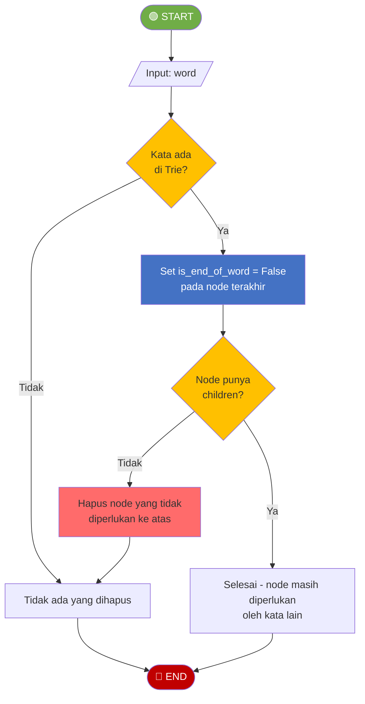

### Template Kode

```python
"""
============================================================
TUGAS TERSTRUKTUR 1: Trie dengan Autocomplete
============================================================
Nama  : ____________________
NIM   : ____________________
Kelas : ____________________
============================================================
"""

class TrieNode:
    def __init__(self):
        self.children = {}
        self.is_end_of_word = False


class Trie:
    def __init__(self):
        self.root = TrieNode()
    
    # ========== METHOD DARI TEORI ==========
    def insert(self, word):
        """Menambahkan kata ke Trie — O(L)"""
        # COPY dari contoh di teori
        pass
    
    def search(self, word):
        """Mencari kata exact — O(L)"""
        # COPY dari contoh di teori
        pass
    
    def starts_with(self, prefix):
        """Cek apakah ada kata dengan prefix tertentu — O(L)"""
        # COPY dari contoh di teori
        pass
    
    # ========== METHOD BARU (TUGAS) ==========
    def delete(self, word):
        """
        Menghapus kata dari Trie
        Return True jika berhasil, False jika kata tidak ada
        
        Aturan:
        - Jika kata tidak ada → return False
        - Jika node masih diperlukan kata lain → hanya ubah is_end_of_word
        - Jika node tidak diperlukan → hapus node
        """
        # TODO: Implementasikan berdasarkan flowchart DELETE
        pass
    
    def autocomplete(self, prefix, max_results=5):
        """
        Mengembalikan daftar kata yang dimulai dengan prefix
        Batasi jumlah hasil dengan max_results
        
        Contoh:
            autocomplete("ca") → ["car", "card", "care", "cat"]
            autocomplete("ca", 2) → ["car", "card"]
        """
        # TODO: Implementasikan
        # Hint: Navigasi ke node prefix, lalu DFS untuk kumpulkan kata
        pass
    
    def count_words(self):
        """
        Menghitung total kata yang tersimpan di Trie
        """
        # TODO: Implementasikan (gunakan DFS)
        pass
    
    def count_prefixes(self, prefix):
        """
        Menghitung berapa kata yang memiliki prefix tertentu
        
        Contoh:
            Trie berisi: ["car", "card", "care", "cat", "dog"]
            count_prefixes("car") → 3 (car, card, care)
            count_prefixes("d") → 1 (dog)
        """
        # TODO: Implementasikan
        pass


# === TEST CASES ===
if __name__ == "__main__":
    print("=" * 50)
    print("TEST TRIE DENGAN AUTOCOMPLETE")
    print("=" * 50)
    
    trie = Trie()
    words = ["apple", "app", "application", "apply", "banana", "band", "bandung"]
    for w in words:
        trie.insert(w)
    
    # Test search
    assert trie.search("apple") == True, "GAGAL: search apple"
    assert trie.search("app") == True, "GAGAL: search app"
    assert trie.search("ap") == False, "GAGAL: ap bukan kata"
    print("✓ Test search PASSED")
    
    # Test autocomplete
    results = trie.autocomplete("app")
    assert "apple" in results, "GAGAL: autocomplete app"
    assert "application" in results, "GAGAL: autocomplete app"
    assert "apply" in results, "GAGAL: autocomplete app"
    print(f"✓ Test autocomplete('app') = {results}")
    
    # Test autocomplete dengan limit
    results_limited = trie.autocomplete("app", 2)
    assert len(results_limited) <= 2, "GAGAL: max_results"
    print(f"✓ Test autocomplete('app', 2) = {results_limited}")
    
    # Test count_words
    assert trie.count_words() == 7, "GAGAL: count_words"
    print("✓ Test count_words PASSED")
    
    # Test count_prefixes
    assert trie.count_prefixes("app") == 4, "GAGAL: count_prefixes app"
    assert trie.count_prefixes("ban") == 2, "GAGAL: count_prefixes ban"
    print("✓ Test count_prefixes PASSED")
    
    # Test delete
    assert trie.delete("app") == True, "GAGAL: delete app"
    assert trie.search("app") == False, "GAGAL: app harus terhapus"
    assert trie.search("apple") == True, "GAGAL: apple harus tetap ada"
    print("✓ Test delete PASSED")
    
    # Test delete kata yang tidak ada
    assert trie.delete("xyz") == False, "GAGAL: delete kata tidak ada"
    print("✓ Test delete kata tidak ada PASSED")
    
    print("=" * 50)
    print("🎉 SEMUA TEST PASSED!")
    print("=" * 50)
```

---

## Tugas 2: Operasi Tensor Sederhana dengan Python Murni (40 menit)

### Deskripsi
Implementasikan operasi tensor dasar **tanpa NumPy** untuk memahami cara kerja tensor di level fundamental.

### Template Kode

```python
"""
============================================================
TUGAS TERSTRUKTUR 2: Operasi Tensor Sederhana (Tanpa NumPy)
============================================================
Nama  : ____________________
NIM   : ____________________
Kelas : ____________________
============================================================
"""

def get_shape(tensor):
    """
    Mengembalikan shape (dimensi) dari tensor
    
    Contoh:
        get_shape(5) → ()
        get_shape([1, 2, 3]) → (3,)
        get_shape([[1, 2], [3, 4]]) → (2, 2)
        get_shape([[[1,2],[3,4]],[[5,6],[7,8]]]) → (2, 2, 2)
    """
    # TODO: Implementasikan (gunakan rekursi)
    pass


def get_ndim(tensor):
    """
    Mengembalikan jumlah dimensi tensor
    
    Contoh:
        get_ndim(5) → 0
        get_ndim([1, 2, 3]) → 1
        get_ndim([[1, 2], [3, 4]]) → 2
    """
    # TODO: Implementasikan
    pass


def tensor_add(a, b):
    """
    Menjumlahkan dua tensor dengan shape yang sama (element-wise)
    
    Contoh:
        tensor_add([1, 2, 3], [4, 5, 6]) → [5, 7, 9]
        tensor_add([[1, 2], [3, 4]], [[5, 6], [7, 8]]) → [[6, 8], [10, 12]]
    """
    # TODO: Implementasikan (gunakan rekursi)
    pass


def tensor_scalar_multiply(tensor, scalar):
    """
    Mengalikan setiap elemen tensor dengan scalar
    
    Contoh:
        tensor_scalar_multiply([1, 2, 3], 2) → [2, 4, 6]
        tensor_scalar_multiply([[1, 2], [3, 4]], 3) → [[3, 6], [9, 12]]
    """
    # TODO: Implementasikan (gunakan rekursi)
    pass


def dot_product(a, b):
    """
    Menghitung dot product dua vektor (1-D tensor)
    
    Contoh:
        dot_product([1, 2, 3], [4, 5, 6]) → 32  (1*4 + 2*5 + 3*6)
    """
    # TODO: Implementasikan
    pass


def matrix_multiply(a, b):
    """
    Perkalian dua matrix (2-D tensor)
    
    Contoh:
        A = [[1, 2], [3, 4]]       (2×2)
        B = [[5, 6], [7, 8]]       (2×2)
        Result = [[19, 22], [43, 50]]
    """
    # TODO: Implementasikan
    # Hint: result[i][j] = sum(a[i][k] * b[k][j] for k in range(cols_a))
    pass


def flatten(tensor):
    """
    Mengubah tensor multidimensi menjadi 1-D
    
    Contoh:
        flatten([[1, 2], [3, 4]]) → [1, 2, 3, 4]
        flatten([[[1, 2], [3, 4]], [[5, 6], [7, 8]]]) → [1, 2, 3, 4, 5, 6, 7, 8]
    """
    # TODO: Implementasikan (gunakan rekursi)
    pass


def reshape(flat_list, shape):
    """
    Mengubah list 1-D menjadi tensor dengan shape tertentu
    
    Contoh:
        reshape([1, 2, 3, 4, 5, 6], (2, 3)) → [[1, 2, 3], [4, 5, 6]]
        reshape([1, 2, 3, 4], (2, 2)) → [[1, 2], [3, 4]]
    """
    # TODO: Implementasikan
    pass


# === TEST CASES ===
if __name__ == "__main__":
    print("=" * 50)
    print("TEST OPERASI TENSOR SEDERHANA")
    print("=" * 50)
    
    # Test get_shape
    assert get_shape(5) == (), "GAGAL: scalar shape"
    assert get_shape([1, 2, 3]) == (3,), "GAGAL: vector shape"
    assert get_shape([[1, 2], [3, 4]]) == (2, 2), "GAGAL: matrix shape"
    assert get_shape([[[1,2],[3,4]],[[5,6],[7,8]]]) == (2, 2, 2), "GAGAL: 3D shape"
    print("✓ Test get_shape PASSED")
    
    # Test get_ndim
    assert get_ndim(5) == 0, "GAGAL: scalar ndim"
    assert get_ndim([1, 2, 3]) == 1, "GAGAL: vector ndim"
    assert get_ndim([[1, 2], [3, 4]]) == 2, "GAGAL: matrix ndim"
    print("✓ Test get_ndim PASSED")
    
    # Test tensor_add
    assert tensor_add([1, 2, 3], [4, 5, 6]) == [5, 7, 9], "GAGAL: vector add"
    assert tensor_add([[1, 2], [3, 4]], [[5, 6], [7, 8]]) == [[6, 8], [10, 12]], "GAGAL: matrix add"
    print("✓ Test tensor_add PASSED")
    
    # Test tensor_scalar_multiply
    assert tensor_scalar_multiply([1, 2, 3], 2) == [2, 4, 6], "GAGAL: scalar multiply"
    assert tensor_scalar_multiply([[1, 2], [3, 4]], 3) == [[3, 6], [9, 12]], "GAGAL: matrix scalar multiply"
    print("✓ Test tensor_scalar_multiply PASSED")
    
    # Test dot_product
    assert dot_product([1, 2, 3], [4, 5, 6]) == 32, "GAGAL: dot product"
    print("✓ Test dot_product PASSED")
    
    # Test matrix_multiply
    result = matrix_multiply([[1, 2], [3, 4]], [[5, 6], [7, 8]])
    assert result == [[19, 22], [43, 50]], "GAGAL: matrix multiply"
    print("✓ Test matrix_multiply PASSED")
    
    # Test flatten
    assert flatten([[1, 2], [3, 4]]) == [1, 2, 3, 4], "GAGAL: flatten 2D"
    assert flatten([[[1, 2], [3, 4]], [[5, 6], [7, 8]]]) == [1, 2, 3, 4, 5, 6, 7, 8], "GAGAL: flatten 3D"
    print("✓ Test flatten PASSED")
    
    # Test reshape
    assert reshape([1, 2, 3, 4, 5, 6], (2, 3)) == [[1, 2, 3], [4, 5, 6]], "GAGAL: reshape"
    assert reshape([1, 2, 3, 4], (2, 2)) == [[1, 2], [3, 4]], "GAGAL: reshape"
    print("✓ Test reshape PASSED")
    
    print("=" * 50)
    print("🎉 SEMUA TEST PASSED!")
    print("=" * 50)
```

---

## Tugas 3: Analisis Penerapan Struktur Data — Studi Kasus (40 menit)

### Deskripsi
Jawab pertanyaan analisis berikut berdasarkan pemahaman materi seluruh semester.

### Template Kode

```python
"""
============================================================
TUGAS TERSTRUKTUR 3: Analisis Penerapan Struktur Data
============================================================
Nama  : ____________________
NIM   : ____________________
Kelas : ____________________
============================================================
"""

# ============================================================
# JAWABAN TUGAS (ISI DI BAWAH INI)
# ============================================================
"""
BAGIAN A: PILIH STRUKTUR DATA YANG TEPAT

Untuk setiap skenario di bawah, tentukan struktur data yang paling tepat
dan jelaskan alasannya beserta kompleksitas waktu operasi utamanya.

1. Sistem autocomplete pada search bar e-commerce dengan 1 juta produk.
   User mengetik prefix dan muncul saran produk.
   
   Struktur Data: 
   Alasan:
   Kompleksitas:


2. Sistem GPS yang mencari rute terpendek dari titik A ke titik B
   melalui jaringan jalan yang saling terhubung.
   
   Struktur Data:
   Alasan:
   Kompleksitas:


3. Browser history yang memungkinkan user kembali ke halaman
   sebelumnya (back button) dan maju kembali (forward button).
   
   Struktur Data:
   Alasan:
   Kompleksitas:


4. Sistem antrian pasien rumah sakit di mana pasien gawat darurat
   harus dilayani lebih dulu dari pasien biasa.
   
   Struktur Data:
   Alasan:
   Kompleksitas:


5. Cache server yang menyimpan 10.000 pasangan key-value dan
   membutuhkan waktu lookup secepat mungkin.
   
   Struktur Data:
   Alasan:
   Kompleksitas:


BAGIAN B: ANALISIS SKENARIO BIG DATA

1. Sebuah platform media sosial memiliki 500 juta user.
   Mengapa adjacency matrix TIDAK cocok untuk menyimpan relasi pertemanan?
   Apa alternatifnya?
   
   Jawab:


2. Sebuah e-commerce memproses 100.000 transaksi per detik.
   Mengapa message queue (seperti Kafka) diperlukan?
   Bagaimana konsep Queue (FIFO) diterapkan di sini?
   
   Jawab:


3. Sebuah search engine perlu mengecek apakah URL sudah pernah
   di-crawl dari miliaran URL yang sudah ada.
   Mengapa Bloom Filter lebih cocok daripada Hash Set biasa?
   
   Jawab:


BAGIAN C: REFLEKSI

1. Dari semua struktur data yang dipelajari semester ini,
   mana yang menurut Anda paling penting untuk bidang Sistem Informasi?
   Jelaskan alasannya!
   
   Jawab:


2. Berikan 1 contoh penerapan struktur data dalam pekerjaan
   sehari-hari seorang Sistem Informasi professional!
   
   Jawab:


"""
```

---

# BAGIAN D: BELAJAR MANDIRI (190 Menit)

> 📚 **Bagian ini dikerjakan mahasiswa secara mandiri di luar kelas**
> **Tidak dikumpulkan**, tetapi penting untuk pemahaman materi dan persiapan UAS.

---

## D1. Membaca Referensi (60 menit)

### Bacaan Wajib:
1. **Goodrich et al., Chapter 12.3** - Pattern Matching (Trie)
2. **Sedgewick & Wayne, Chapter 5.2** - Tries

### Bacaan Tambahan:
- [GeeksforGeeks - Trie Data Structure](https://www.geeksforgeeks.org/trie-insert-and-search/)
- [Visualgo - Trie](https://visualgo.net/en/dfsbfs) (lihat bagian Suffix Trie)
- [NumPy Documentation - Array Basics](https://numpy.org/doc/stable/user/absolute_beginners.html)
- [Towards Data Science - Tensors Explained](https://towardsdatascience.com/what-is-a-tensor-in-machine-learning/)

---

## D2. Video Tutorial (40 menit)

Tonton dan buat catatan:

1. **Trie Data Structure — NeetCode** (~12 menit)
   - https://www.youtube.com/watch?v=oobqoCJlHA0
   
2. **Tensors Explained — 3Blue1Brown** (~15 menit)
   - https://www.youtube.com/watch?v=f5liqUk0ZTw

3. **Data Structures Used in Big Data — Fireship** (~10 menit)
   - https://www.youtube.com/watch?v=W_aFdkuBGCM

---

## D3. Latihan Mandiri (60 menit)

### Soal Pilihan Ganda

**1.** Trie sangat efisien untuk operasi berikut KECUALI...
- [ ] a. Autocomplete berdasarkan prefix
- [ ] b. Pencarian kata exact
- [ ] c. Mencari substring di tengah kata
- [ ] d. Spell checking

**2.** Tensor 3-D memiliki berapa sumbu (axis)?
- [ ] a. 1
- [ ] b. 2
- [ ] c. 3
- [ ] d. 4

**3.** Gambar RGB berukuran 1920×1080 piksel direpresentasikan sebagai tensor dengan shape...
- [ ] a. (1920, 1080)
- [ ] b. (1080, 1920, 3)
- [ ] c. (3, 1920, 1080)
- [ ] d. (1920, 1080, 1)

**4.** Mengapa B-Tree lebih cocok untuk database indexing daripada BST biasa?
- [ ] a. B-Tree lebih mudah diimplementasikan
- [ ] b. B-Tree memiliki tinggi lebih rendah sehingga mengurangi disk access
- [ ] c. B-Tree menggunakan lebih sedikit memori
- [ ] d. B-Tree selalu lebih cepat dari BST

**5.** Bloom Filter memiliki karakteristik unik yaitu...
- [ ] a. Tidak pernah menghasilkan false positive
- [ ] b. Tidak pernah menghasilkan false negative
- [ ] c. Tidak pernah menghasilkan error
- [ ] d. Selalu memberikan jawaban pasti

### Latihan Coding (Opsional)

Kerjakan di platform online:
- **LeetCode Easy #208** - Implement Trie (Prefix Tree)
- **LeetCode Easy #14** - Longest Common Prefix
- **LeetCode Medium #211** - Design Add and Search Words Data Structure
- **HackerRank** - Contacts (Trie)

---

## D4. Persiapan UAS (30 menit)

### Materi UAS (Pertemuan 9-15)

| Pertemuan | Materi | Topik Penting |
|-----------|--------|---------------|
| 9 | Tree & Binary Tree | Traversal (Pre/In/Post/Level order) |
| 10 | Binary Search Tree | Insert, Search, Delete, Balancing |
| 11 | Graph | Adjacency Matrix/List, BFS, DFS |
| 12 | Searching | Linear Search, Binary Search, Hash Table |
| 13 | Sorting Dasar | Bubble, Selection, Insertion Sort |
| 14 | Sorting Lanjutan | Merge Sort, Quick Sort, Heap Sort |
| 15 | Big Data & AI | Trie, Tensor, Penerapan |

### Tips Persiapan UAS

1. **Kuasai Trace Algoritma** — UAS sering meminta trace langkah-langkah sorting, traversal tree, BFS/DFS secara manual
2. **Hafalkan Kompleksitas** — Tabel Big-O untuk semua struktur data dan algoritma
3. **Latihan Coding** — Pastikan bisa implementasi BST, Graph traversal, dan sorting tanpa melihat catatan
4. **Pahami Trade-off** — Kapan pakai array vs linked list, BST vs hash table, merge sort vs quick sort
5. **Review Contoh Soal UAS di RPS** — Kerjakan tanpa melihat jawaban terlebih dahulu

### Checklist Persiapan UAS

```
CHECKLIST PERSIAPAN UAS STRUKTUR DATA
============================================================
[ ] Bisa menggambar BST dari urutan insert tertentu
[ ] Bisa melakukan traversal Inorder/Preorder/Postorder
[ ] Bisa menghapus node dari BST (3 kasus)
[ ] Bisa menggambar adjacency matrix & list dari graph
[ ] Bisa melakukan BFS dan DFS secara manual
[ ] Bisa implementasi Binary Search (iteratif & rekursif)
[ ] Bisa menjelaskan Hash Table dan collision handling
[ ] Bisa men-trace Bubble, Selection, Insertion Sort
[ ] Bisa men-trace Merge Sort dan Quick Sort
[ ] Bisa membandingkan kompleksitas semua sorting
[ ] Bisa menjelaskan konsep Trie dan operasinya
[ ] Bisa menjelaskan konsep Tensor dan dimensinya
[ ] Bisa memilih struktur data yang tepat untuk skenario tertentu
============================================================
```

---

---

**Selamat Belajar! 🚀**

*Modul ini disusun oleh Aidil Saputra Kirsan (myst-tech.com), Institut Teknologi Kalimantan.*